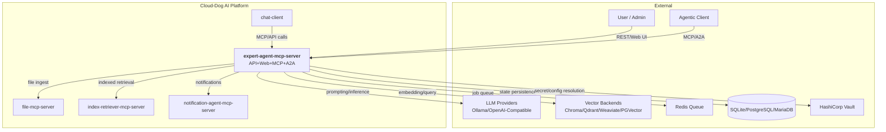
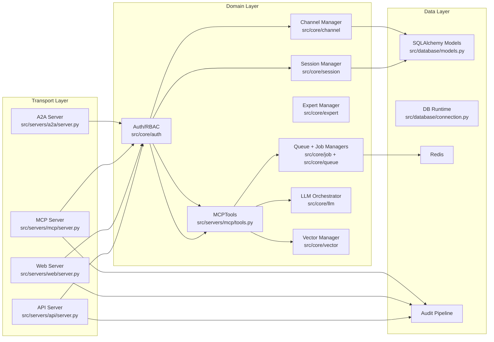
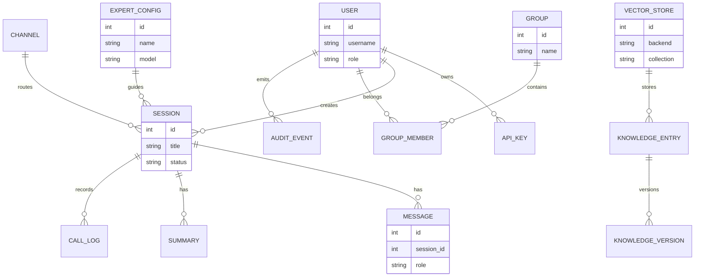
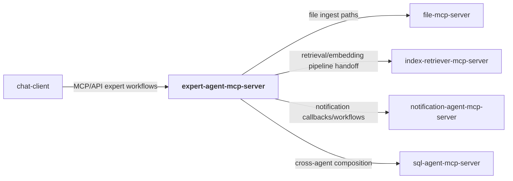
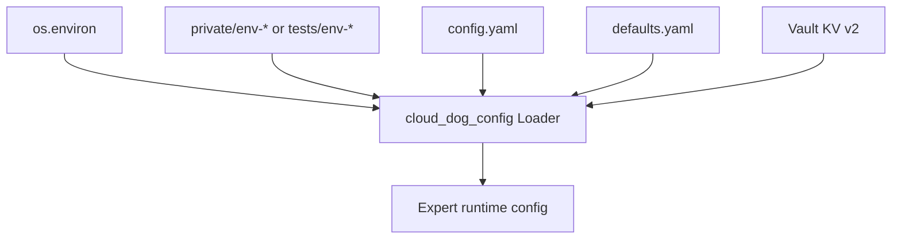
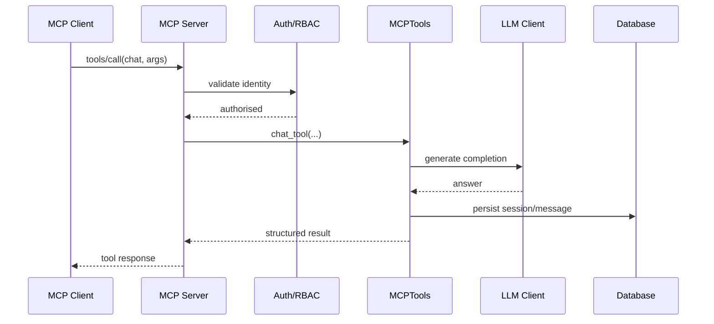
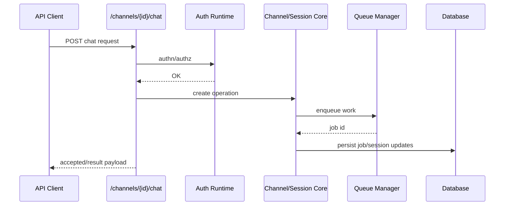

# Expert Agent MCP Server — Architecture

## W28A-421 Review Status
- Reviewed for external/shareable publication during W28A-421.
- Source basis: `defaults.yaml`, 29 server source files, 186 discovered routes/endpoints, and 29 MCP tools.
- Internal-only absolute paths, environment-specific hosts, and private registries have been removed from this shareable document set.

## 1. Overview
`expert-agent-mcp-server` is a multi-interface expert reasoning service in the Cloud-Dog AI platform. It exposes REST API, Web UI, MCP, and A2A transports over a shared domain core for sessions, experts, channels, vector retrieval, knowledge management, and job orchestration.

The runtime is designed as one logical system with four server front doors (`api`, `web`, `mcp`, `a2a`) that share common managers and persistence. This keeps behaviour consistent across interfaces while supporting both human-admin and agentic workflows.

The service acts as both a consumer and provider in the wider platform: it consumes LLM/vector/cache/storage infrastructure and can be consumed by `chat-client` and other orchestrators through MCP and API surfaces.

## 2. System Context Diagram


The service is positioned as a central expert reasoning backend with multi-transport access and strong integration to model, vector, queue, and platform services.

## 3. Component Architecture


Transport adapters share a common domain and persistence core, reducing drift between API/Web/MCP/A2A execution paths.

## 4. Module Decomposition
| Module | Path | Responsibility | Platform Package |
|---|---|---|---|
| API server | `src/servers/api/server.py` | REST bootstrap and route mounting | `cloud_dog_api_kit` |
| Web server | `src/servers/web/server.py` | Admin/UI pages and web flows | `cloud_dog_api_kit` |
| MCP server | `src/servers/mcp/server.py` | MCP protocol routing and tool dispatch | — |
| A2A server | `src/servers/a2a/server.py` | Agent-to-agent endpoints and streaming | — |
| MCP tool implementation | `src/servers/mcp/tools.py` | Expert/session/vector MCP operations | — |
| Auth core | `src/core/auth/` | API key, token, password, lockout, RBAC | `cloud_dog_idam` |
| Session + channel core | `src/core/session/`, `src/core/channel/` | Conversation and channel lifecycles | — |
| Queue/job core | `src/core/queue/`, `src/core/job/` | Async processing and callback orchestration | `cloud_dog_jobs` |
| LLM integration | `src/common/llm_client.py`, `src/core/llm/` | Model/provider abstraction and orchestration | `cloud_dog_llm` |
| Vector integration | `src/core/vector/` | Vector store abstraction and retrieval | `cloud_dog_vdb` |
| Configuration | `src/config/loader.py`, `src/config/models.py` | Layered config loading and validation | `cloud_dog_config` |
| Persistence | `src/database/models.py`, `src/database/connection.py` | ORM schema and DB session handling | `cloud_dog_db` |
| Logging/audit | `src/utils/logger.py`, `src/core/audit/` | Structured logs and audit records | `cloud_dog_logging` |

## 5. Data Model


Core persistence links users/groups/auth state to session/message history, expert configuration, vector data metadata, and full audit/call traceability.

## 6. Interface Specifications
### 6.1 REST API
| Method | Path | Description | Auth |
|---|---|---|---|
| GET | `/health` | Service health | None |
| GET | `/mcp/health` | MCP dependency health summary | API key |
| GET | `/a2a/health` | A2A dependency health summary | API key |
| POST | `/auth/login` | User login/token issue | Credential-based |
| GET | `/sessions` | List sessions | API key/JWT |
| POST | `/sessions/{session_id}/messages` | Add session message | API key/JWT |
| POST | `/channels/{channel_id}/chat` | Channel chat execution | API key/JWT |
| POST | `/vector-stores/{store_id}/query` | Vector query | API key/JWT |
| POST | `/files/upload` | File upload | API key/JWT |
| GET | `/jobs` | Job queue status and jobs | API key/JWT |

### 6.2 MCP Tools
| Tool | Description | Category |
|---|---|---|
| `chat` | Execute expert chat turn | conversation |
| `start_session` / `resume_session` / `end_session` | Session lifecycle control | session |
| `list_sessions` / `session_status` | Session introspection | session |
| `get_history` / `get_session_by_key` / `get_history_by_key` | History retrieval | history |
| `share_session` / `unshare_session` | Session sharing controls | collaboration |
| `summarize_session` / `get_summaries` | Session summarisation | summarisation |
| `list_experts` / `get_expert` | Expert catalogue lookup | experts |
| `vector_search` / `vector_add` | Vector retrieval and writes | retrieval |

### 6.3 A2A Endpoints
| Endpoint | Description | Protocol |
|---|---|---|
| `/a2a/health` | A2A health/readiness | HTTP GET |
| `/health` (A2A app) | Basic runtime health | HTTP GET |
| A2A server websocket routes | Agent event exchange | WebSocket |

## 7. Dependencies & External Services
### 7.1 Platform Packages
| Package | Version (pyproject) | Usage in this project |
|---|---|---|
| `cloud-dog-config` | `>=0.2.0` | Config load/merge and vault-aware resolution |
| `cloud-dog-logging` | `>=0.2.0` | Structured logging and observability |
| `cloud-dog-api-kit` | `>=0.2.0` | App factory and middleware integration |
| `cloud-dog-idam` | `>=0.2.0` | AuthN/AuthZ primitives |
| `cloud-dog-llm` | `>=0.2.0` | Model abstraction |
| `cloud-dog-db` | `>=0.1.0` | Database integration |
| `cloud-dog-jobs` | `>=0.2.0` | Job and queue support |
| `cloud-dog-vdb` | `>=0.1.0` | Vector store abstraction |

### 7.2 External Services
| Service | Purpose | Connection | Vault Path |
|---|---|---|---|
| PostgreSQL/SQLite/MariaDB | Core persistence | `db.*` / DSN | `dev.databases.*` |
| Redis | Queue backend | `redis.*` | `dev.redis.*` |
| LLM providers | Inference | `llm.*` | `dev.models.*` |
| Vector backends | Embeddings and retrieval | `vector_stores.*` | `dev.vector.*` |
| Vault | Secret retrieval | `VAULT_ADDR`/token | `secret/*` |

### 7.3 Cross-Project Dependencies


## 8. Configuration Architecture


Major configuration sections include `api_server`, `web_server`, `mcp_server`, `a2a_server`, `auth`, `queue`, `vector_stores`, `llm`, `db`, and `observability` controls.

## 9. Security Architecture
- Authentication: API keys, user/password, and token flows through core auth modules.
- Authorisation: role-based controls for admin/writer/reader operations across API, MCP, and A2A.
- Secrets: environment and Vault-backed secret inputs; no hardcoded credentials in source.
- Audit: structured audit events and call logs for operational and compliance traceability.
- Network: separate ports per transport with health and readiness probes for each surface.

## 10. Deployment Architecture
```mermaid
graph TB
    subgraph Development
        DEV[Local venv<br/>multi-process startup scripts]
    end

    subgraph Preprod
        PRE[Docker container(s)<br/>API/Web/MCP/A2A]
        PREDB[(PostgreSQL/MariaDB)]
        PRER[(Redis)]
        PREV[Vault]
    end

    subgraph Production
        PROD[Terraform-managed runtime]
        PRODDB[(Managed DB)]
        PRODR[(Managed Redis)]
        PRODV[Vault]
        PROXY[TLS Proxy]
    end

    DEV -.->|promote| PRE
    PRE -.->|promote| PROD
    PRE --> PREDB
    PRE --> PRER
    PRE --> PREV
    PROD --> PRODDB
    PROD --> PRODR
    PROD --> PRODV
```

## 11. Key Flows
### 11.1 MCP Chat Tool Flow


### 11.2 API Channel Chat + Queue Flow


## 12. Non-Functional Characteristics
| Characteristic | Approach |
|---|---|
| Scalability | Multi-server transport split with queue-backed async workloads and pluggable vector backends |
| Reliability | Health endpoints per transport, queue retry patterns, and bounded operation controls |
| Observability | Structured logs, audit events, and explicit health/status routes |
| Performance | Async transport handlers, cached context flows, and backend-specific vector optimisation |
| Maintainability | Clear `servers/` vs `core/` vs `database/` separation with broad UT/ST/IT/AT coverage |

## 13. W28A-239 Orchestration Enhancement
### 13.1 Service Composition Layer

`W28A-239` inserts a `Service Composition Layer` between transport handlers and the existing domain managers. This layer resolves bound services, prompt assignments, sub-expert delegation, and transactional execution while preserving the current REST, MCP, A2A, and WebUI entry points.

### 13.2 Updated Logical Layers

1. Transport Layer
   - REST routes under `src/servers/api/routes/`
   - MCP JSON-RPC in `src/servers/mcp/server.py`
   - Web UI in `cloud-dog-ai-ui-monorepo/apps/expert-agent`
2. Service Composition Layer
   - `ServiceCompositionManager`
   - `DelegationManager`
   - `TransactionalExecutor`
   - Prompt-template expansion in `src/core/prompt/manager.py`
3. Domain Layer
   - expert, session, auth, service, channel, and job managers
4. Data Layer
   - SQLAlchemy ORM models and Alembic migrations
   - external MCP, A2A, and REST tool services

### 13.3 Updated Entity Relationships

```text
ExpertConfig 1 --- * ServiceBinding * --- 1 ExternalService
ExpertConfig 1 --- * SubExpertBinding * --- 1 ExpertConfig
ExpertConfig 1 --- * ExpertPromptAssignment * --- 1 PromptTemplate
Session 1 --- * ServiceInvocationLog
Session 1 --- * Session (child sessions via parent_session_id)
```

### 13.4 Transactional Execution Flow

1. Caller invokes REST `POST /experts/{id}/execute` or MCP `execute_tool`.
2. Transport authenticates the caller and passes user context into `TransactionalExecutor`.
3. `TransactionalExecutor` loads the expert, expands prompt variables, and merges caller-supplied context.
4. Bound services are resolved through `ServiceCompositionManager`.
5. Optional remote tool calls are executed with health checks, timeout enforcement, and invocation logging.
6. Optional sub-expert tasks are delegated through `DelegationManager`, which creates child sessions and enforces loop prevention.
7. The executor returns a structured result with output text, token usage, invoked services, and duration.

### 13.5 MCP Service Invocation Flow

1. Expert configuration binds an `ExternalService` of type `mcp`.
2. `ServiceCompositionManager.discover_tools()` calls remote `tools/list`.
3. Tool metadata is cached and exposed through REST, MCP, and WebUI surfaces.
4. `invoke_tool()` sends `tools/call` JSON-RPC with auth headers derived from the bound service.
5. A `ServiceInvocationLog` row records timing, status, and token metadata for audit and diagnostics.

### 13.6 Self-Referencing Delegation Flow

1. A parent expert is configured with one or more `SubExpertBinding` rows.
2. Delegation request enters `DelegationManager.delegate()`.
3. The manager walks parent-session ancestry to detect loops and enforce `max_depth`.
4. A child session is created with `parent_session_id` linking back to the initiating session.
5. Child execution result is returned to the parent as structured tool output and remains visible through the delegation tree API.

### 13.7 W28A-874 Orchestration Enhancement — Extended Architecture

#### 13.7.1 Composition Topology

A controller expert combines sub-experts and external services into a single
orchestrated execution. The topology is a directed acyclic graph:

```
┌─────────────────────────────────────────────────────┐
│                  Controller Expert                   │
│  prompt: "You are a coordinator. Use these tools..." │
│  is_controller: true                                │
│  execution_mode: chat | transactional | hybrid      │
├─────────────────────────────────────────────────────┤
│                 Unified Tool Surface                │
│  (priority-ordered, name-collision-resolved)        │
├──────┬──────┬──────┬──────┬─────────────────────────┤
│ Sub  │ Sub  │ MCP  │ A2A  │  REST                   │
│Expert│Expert│ Svc  │ Svc  │  Svc                    │
│  A   │  B   │  C   │  D   │   E                     │
└──┬───┴──┬───┴──┬───┴──┬───┴──┬──────────────────────┘
   │      │      │      │      │
   ▼      ▼      ▼      ▼      ▼
 Local  Local  Remote  Remote  Remote
Expert  Expert  MCP     A2A    REST
Session Session Server  Server  API
```

Each binding carries `priority` (lower = higher precedence) and
`enabled` flag. The unified tool surface is assembled by
`ServiceCompositionManager.get_available_tools(expert_id)` at
execution time.

#### 13.7.2 Scenario Execution Flow

A scenario is a named, versioned, ordered sequence of steps. Each step
references an expert or service and defines input/output bindings.

```
Scenario "web-content-pipeline" v1
┌────────────────────────────────────────────────────┐
│ Step 1: search-mcp.search(topic="${input}")         │
│   output: search_results                           │
├────────────────────────────────────────────────────┤
│ Step 2: file-mcp.write_file(content="${search_results}") │
│   output: file_path                                │
├────────────────────────────────────────────────────┤
│ Step 3: translator-expert.execute(text="${search_results}") │
│   condition: if "${input.translate}" == "true"      │
│   output: translated_text                          │
├────────────────────────────────────────────────────┤
│ Step 4: controller-expert.summarise(all_outputs)    │
│   output: final_report                             │
└────────────────────────────────────────────────────┘
```

Execution creates a parent session. Each step creates a child session
via the delegation tree. Step outputs are bound as variables for
subsequent step input interpolation.

Error handling per step: `on_error: retry(3) | skip | abort`.

#### 13.7.3 Context Propagation Model

Context flows through the delegation chain:

```
Caller Context
  ├── prior_messages: injected conversation history
  ├── documents: reference text (RAG-style)
  ├── variables: key-value pairs for prompt interpolation
  └── context_group_id: shared knowledge pool across sessions

         │
         ▼
   Controller Session (context_retention: rolling/20)
         │
    ┌────┴────┐
    ▼         ▼
 Sub-Expert  Service
  Session    Invocation
 (inherits   (receives
  parent      variables
  context)    only)
```

Context retention modes:
- `none`: ephemeral, discarded after execution
- `session`: retained for session lifetime
- `rolling`: last N messages retained (configurable, default 20)

Cross-session sharing via `context_group_id`: sessions in the same
group share a `KnowledgeHistoryManager` pool, enabling multi-session
workflows to build on shared state.

#### 13.7.4 Remote Execution Sequence

```
External Caller (chat-client, curl, another agent)
    │
    ├── REST: POST /experts/{id}/execute
    │         {input_text, parameters, context, session_id}
    │
    ├── MCP:  tools/call execute_expert
    │         {expert_id, input_text, parameters, context}
    │
    └── A2A:  POST /a2a/tasks
              {skill_id: "expert:{id}", input: {text, context}}
    │
    ▼
TransactionalExecutor.execute()
    │
    ├── 1. Load expert config + resolve bindings
    ├── 2. Expand prompt with context variables
    ├── 3. Pre-service calls (from parameters)
    ├── 4. Sub-expert delegations (from parameters or LLM)
    ├── 5. LLM generation with full context
    ├── 6. Post-service calls (with output interpolation)
    └── 7. Return structured result
    │
    ▼
Response: {output_text, token_usage, services_invoked,
           delegations, execution_time_ms, session_id}
```

#### 13.7.5 New Data Entities

```
Scenario          1 --- * ScenarioStep
ScenarioStep      * --- 1 ExpertConfig | ExternalService
ScenarioStep      1 --- * StepCondition
ScenarioExecution 1 --- 1 Scenario
ScenarioExecution 1 --- 1 Session (parent)
ScenarioExecution 1 --- * StepExecution
StepExecution     1 --- 1 Session (child)

ExpertConfig gains: is_controller (bool), default_execution_mode (enum),
                    context_retention (enum), context_retention_limit (int),
                    context_group_id (optional string)
```


<!-- W28C-1710a recovery: full content from archive/2026-06-12/AGENT_RULES.md (archived sha256=c24db552b3be, 27 lines) -->

## Recovered domain content — `archive/2026-06-12/AGENT_RULES.md` (27 lines)

_This section carries forward the full content of the archived predecessor doc verbatim. Topic checklist + SHA256 chain in `cloud-dog-ai-platform-standards/working/evidence/W28C-1710a/per-doc/expert-agent-mcp-server/AGENT_RULES.md.topics.tsv`. Archive contents are unchanged (sha256 stable)._

## Agent rules (build/test automation)

### Server control script usage (mandatory)

Automation MUST use `server_control.sh` to start/stop services. Do **not** start servers via direct `python ...` invocation or ad-hoc process management.

- **Start**:
  - `./server_control.sh start`
  - `./server_control.sh start api|mcp|a2a|web`
- **Stop**:
  - `./server_control.sh stop`
  - `./server_control.sh stop api|mcp|a2a|web`
  - `./server_control.sh force-stop api` (only if graceful stop fails)
- **Status**:
  - `./server_control.sh status`
  - `./server_control.sh status api|mcp|a2a|web`
- **Restart**:
  - `./server_control.sh restart`
  - `./server_control.sh restart api|mcp|a2a|web`

### Rationale

- **Consistency**: unified startup/shutdown across environments
- **Process management**: PID/port handling is centralised
- **Configuration**: env/config hierarchy is loaded consistently
- **Health checks & diagnostics**: standardised readiness checks and logs


<!-- W28C-1710a recovery: full content from archive/2026-06-12/FOLDER_STRUCTURE.md (archived sha256=9e41594ebb3c, 17 lines) -->

## Recovered domain content — `archive/2026-06-12/FOLDER_STRUCTURE.md` (17 lines)

_This section carries forward the full content of the archived predecessor doc verbatim. Topic checklist + SHA256 chain in `cloud-dog-ai-platform-standards/working/evidence/W28C-1710a/per-doc/expert-agent-mcp-server/FOLDER_STRUCTURE.md.topics.tsv`. Archive contents are unchanged (sha256 stable)._

## Folder structure

High-level structure (repo root):

- `src/`: application source
- `tests/`: unit/integration/system/application tests
- `docs/`: project documentation
- `scripts/`: utility scripts used by the project
- `database/`: migrations and local database artefacts (only migrations should ever be tracked)
- `prompts/`: prompt templates and prompt documentation
- `templates/`: web templates
- `storage/`, `logs/`, `working/`, `archive/`, `.pids/`: local/runtime artefacts (**not tracked**)

Notes:
- Local databases (`*.db`, `*.sqlite3`) and vector-store data directories are **never committed**.
- Test outputs should be written to `working/` (disposable) or a local `archive/` (also disposable, gitignored).


<!-- W28C-1710a recovery: full content from archive/2026-06-12/NEXT_STEPS.md (archived sha256=db84e166b13d, 300 lines) -->

## Recovered domain content — `archive/2026-06-12/NEXT_STEPS.md` (300 lines)

_This section carries forward the full content of the archived predecessor doc verbatim. Topic checklist + SHA256 chain in `cloud-dog-ai-platform-standards/working/evidence/W28C-1710a/per-doc/expert-agent-mcp-server/NEXT_STEPS.md.topics.tsv`. Archive contents are unchanged (sha256 stable)._

# Next Steps Plan

**Date:** 2025-01-XX  
**Status:** Active Planning  
**Last Updated:** After Phase 9 & 10 Test Completion

---

## Executive Summary

### Current Status
- ✅ **Phase 9 Tests**: 7/7 complete (91 tests passing)
- ✅ **Phase 10 Tests**: 6/6 complete (37 tests passing)
- ✅ **External Services Setup**: Scripts created
- ⚠️ **Test Collection Errors**: 2 test files have collection errors
- 📋 **Remaining Tests**: ~49 tests marked as incomplete in TESTS.md
- 📋 **Remaining Tasks**: ~29 tasks marked as incomplete in TASKS.md

### Test Coverage
- **Total Tests Collected**: 458
- **Tests Passing**: 120+ (from recent runs)
- **Collection Errors**: 2 (UT1.38, UT1.43)
- **Test Files**: 604 test files/modules

---

## Immediate Next Steps (Priority 1)

### 1. Fix Test Collection Errors
**Status:** 🔴 Critical  
**Estimated Time:** 30 minutes

- [ ] Fix UT1.38_SessionQueuing test collection error
- [ ] Fix UT1.43_LongRunningOperations test collection error
- [ ] Verify all tests can be collected without errors
- [ ] Run full test suite to identify any runtime failures

**Files to Check:**
- `tests/unit/UT1.38_SessionQueuing/test_session_queuing.py`
- `tests/unit/UT1.43_LongRunningOperations/test_long_running_operations.py`

### 2. Run Full Test Suite
**Status:** 🔴 Critical  
**Estimated Time:** 1-2 hours

- [ ] Run complete test suite: `pytest tests/ -v`
- [ ] Identify all failing tests
- [ ] Categorize failures (setup issues, implementation gaps, bugs)
- [ ] Create issue list for failures
- [ ] Fix critical failures first

### 3. Address Code TODOs
**Status:** 🟡 High Priority  
**Estimated Time:** 2-3 hours

**TODOs Found:**
- [ ] Add authentication/authorization checks in `src/servers/api/routes/jobs.py` (8 locations)
- [ ] Implement queue removal in jobs route
- [ ] Implement actual job stopping mechanism
- [ ] Extract user_id from API key/session in testing and quality routes

**Files:**
- `src/servers/api/routes/jobs.py`
- `src/servers/api/routes/testing.py`
- `src/servers/api/routes/quality.py`

---

## Short-Term Next Steps (Priority 2)

### 4. Implement High-Priority Unit Tests
**Status:** 🟡 High Priority  
**Estimated Time:** 1-2 days

**Core Functionality Tests:**
- [ ] UT1.1 - Configuration manager parsing and validation
- [ ] UT1.2 - Database manager connection and CRUD operations
- [ ] UT1.3 - Session manager creation and state transitions
- [ ] UT1.4 - User manager authentication and authorization
- [ ] UT1.5 - Group manager membership and permissions
- [ ] UT1.6 - Prompt manager template rendering
- [ ] UT1.7 - LLM provider abstraction interface
- [ ] UT1.8 - Ollama provider integration
- [ ] UT1.9 - OpenAI-compatible provider integration

### 5. Implement High-Priority System Tests
**Status:** 🟡 High Priority  
**Estimated Time:** 1 day

**System Integration Tests:**
- [ ] ST1.1 - API server startup and endpoint accessibility
- [ ] ST1.4 - Web UI server static file serving and template rendering
- [ ] ST1.5 - Inter-server communication and data consistency
- [ ] ST1.6 - Server control script integration with all servers

### 6. Implement High-Priority Application Tests
**Status:** 🟡 High Priority  
**Estimated Time:** 1-2 days

**User Workflow Tests:**
- [ ] AT1.1 - Basic chat interaction with LLM
- [ ] AT1.2 - Multi-turn conversation with context retention
- [ ] AT1.4 - Vector store configuration and access
- [ ] AT1.5 - Group membership and permission management
- [ ] AT1.7 - PII removal from session, history, returned results, and audit
- [ ] AT1.8 - Basic chat interaction with LLM
- [ ] AT1.10 - Context window management for long conversations
- [ ] AT1.12 - Multi-turn conversation with context retention

---

## Medium-Term Next Steps (Priority 3)

### 7. Complete Remaining Core Tests
**Status:** 🟢 Medium Priority  
**Estimated Time:** 3-5 days

**Vector Store Tests:**
- [ ] UT1.15 - Vector store abstraction interface
- [ ] UT1.16 - Chroma integration (development)
- [ ] UT1.17 - Weaviate integration
- [ ] UT1.18 - Qdrant integration
- [ ] UT1.19 - OpenSearch/Elastic integration
- [ ] UT1.20 - PGVector integration (already done, verify)

**Security Tests:**
- [ ] UT1.25 - Authentication token generation and validation
- [ ] UT1.26 - Password hashing and verification
- [ ] UT1.27 - Role-based access control enforcement
- [ ] UT1.28 - Session management and timeout
- [ ] UT1.29 - Audit logging integrity
- [ ] UT1.30 - PII redaction in logs and stored data

### 8. Implement Remaining High-Priority Tasks
**Status:** 🟢 Medium Priority  
**Estimated Time:** 1-2 weeks

**Core Infrastructure:**
- [ ] T001 - Implement four-server architecture (API, MCP, A2A, Web UI)
- [ ] T002 - Set up database schema and migrations
- [ ] T003 - Implement configuration management system
- [ ] T004 - Create session management core
- [ ] T005 - Implement user and group management

**LLM Integration:**
- [ ] T007 - Implement LLM provider abstraction layer
- [ ] T008 - Integrate with Ollama, OpenAI-compatible providers
- [ ] T009 - Create prompt management system
- [ ] T010 - Implement context window management
- [ ] T011 - Add safety and moderation controls

**Vector Store Integration:**
- [ ] T014 - Implement vector store abstraction layer
- [ ] T015 - Integrate with Chroma (development)
- [ ] T016 - Integrate with Weaviate, Qdrant, OpenSearch/Elastic, PGVector
- [ ] T017 - Create indexing and search functionality
- [ ] T018 - Implement lifecycle management (purge, compress, consolidate)

---

## Long-Term Next Steps (Priority 4)

### 9. Advanced Features
**Status:** 🔵 Low Priority  
**Estimated Time:** 2-4 weeks

- [ ] T078 - Implement additional multimodal support features
- [ ] T079 - Add advanced tool integration framework features
- [ ] T065 - Create knowledge graph capabilities
- [ ] T066 - Implement fine-tuning support
- [ ] T067 - Add multi-tenant isolation

### 10. Identity Provider Integration
**Status:** 🔵 Low Priority  
**Estimated Time:** 1-2 weeks

- [ ] T080 - Implement local database authentication (development/testing)
- [ ] T081 - Add Google authentication provider
- [ ] T082 - Add LinkedIn authentication provider
- [ ] T083 - Add Keycloak SAML/OpenID integration

### 11. Performance & Security Testing
**Status:** 🔵 Low Priority  
**Estimated Time:** 1-2 weeks

- [ ] Performance tests (PT1.x)
- [ ] Security tests (QT1.x)
- [ ] Compatibility tests (CT1.x)
- [ ] Load testing
- [ ] Stress testing

---

## External Services Setup

### 12. Complete External Services Configuration
**Status:** 🟡 High Priority  
**Estimated Time:** 2-4 hours

**OpenSearch:**
- [ ] Install `opensearch-py` package
- [ ] Verify collection creation script works
- [ ] Test OpenSearch integration tests

**PostgreSQL/PGVector:**
- [ ] Install `pgvector` extension on PostgreSQL server
- [ ] Verify database/user creation script works
- [ ] Test PGVector integration tests

**MariaDB:**
- [ ] Install `mariadb` Python package
- [ ] Verify database/user creation script works
- [ ] Test MariaDB integration tests

---

## Documentation & Cleanup

### 13. Update Documentation
**Status:** 🟢 Medium Priority  
**Estimated Time:** 1 day

- [ ] Update TESTS.md with test completion status
- [ ] Update TASKS.md with task completion status
- [ ] Update REQUIREMENTS.md with implementation status
- [ ] Create test execution guide
- [ ] Document external service setup procedures

### 14. Code Quality & Cleanup
**Status:** 🟢 Medium Priority  
**Estimated Time:** 1-2 days

- [ ] Remove duplicate code (if any)
- [ ] Fix linting errors
- [ ] Improve code documentation
- [ ] Add type hints where missing
- [ ] Review and optimize performance bottlenecks

---

## Success Metrics

### Immediate (Week 1)
- [ ] All test collection errors fixed
- [ ] Full test suite runs without collection errors
- [ ] All critical TODOs addressed
- [ ] Test pass rate > 90%

### Short-Term (Month 1)
- [ ] All high-priority tests implemented
- [ ] All high-priority tasks completed
- [ ] Test coverage > 80%
- [ ] External services fully configured

### Medium-Term (Month 2-3)
- [ ] All core tests implemented
- [ ] All core tasks completed
- [ ] Test coverage > 90%
- [ ] Documentation complete

---

## Risk Assessment

### High Risk
- **Test Collection Errors**: May indicate structural issues
- **Missing Authentication**: Security vulnerability
- **Incomplete Tests**: Unknown functionality gaps

### Medium Risk
- **External Service Dependencies**: May block integration testing
- **Incomplete Tasks**: May indicate missing features
- **Documentation Gaps**: May slow development

### Low Risk
- **Advanced Features**: Can be deferred
- **Performance Testing**: Can be done later
- **Identity Provider Integration**: Not critical for MVP

---

## Recommendations

1. **Start with Priority 1 items** - Fix collection errors and run full test suite
2. **Address security TODOs immediately** - Authentication/authorization is critical
3. **Focus on core functionality** - Complete high-priority tests and tasks first
4. **Incremental approach** - Complete one category at a time (tests → tasks → features)
5. **Regular test runs** - Run full test suite after each major change
6. **Documentation as you go** - Update docs as you complete items

---

## Notes

- Test collection shows 458 tests, but many may be incomplete or placeholder tests
- Focus on tests that validate core functionality first
- Some tasks may already be implemented but not marked as complete in TASKS.md
- Review existing implementation before creating new tests
- Consider test-driven development for new features


<!-- W28C-1710a recovery: full content from archive/2026-06-12/NEXT_STEPS_PLAN.md (archived sha256=ec0c74b8668c, 310 lines) -->

## Recovered domain content — `archive/2026-06-12/NEXT_STEPS_PLAN.md` (310 lines)

_This section carries forward the full content of the archived predecessor doc verbatim. Topic checklist + SHA256 chain in `cloud-dog-ai-platform-standards/working/evidence/W28C-1710a/per-doc/expert-agent-mcp-server/NEXT_STEPS_PLAN.md.topics.tsv`. Archive contents are unchanged (sha256 stable)._

# Next Steps Plan - Updated

**Date:** 2025-01-XX  
**Status:** Active Planning  
**Last Updated:** After Priority 1 & 2 Completion

---

## Executive Summary

### Current Status
- ✅ **Priority 1**: COMPLETE (test collection errors fixed, full suite run, TODOs addressed)
- ✅ **Priority 2.4**: COMPLETE (high-priority unit tests UT1.1-UT1.9)
- ✅ **Priority 2.5**: COMPLETE (high-priority system tests ST1.1, ST1.4, ST1.5, ST1.6)
- ✅ **Priority 2.6**: COMPLETE (high-priority application tests AT1.1, AT1.2, AT1.4, etc.)
- ⚠️ **Test Failures**: 25 failing tests, 6 collection errors
- 📋 **Remaining Tests**: ~243 tests marked as incomplete in TESTS.md
- 📋 **Remaining Tasks**: ~224 tasks marked as incomplete in TASKS.md

### Test Coverage
- **Total Tests Collected**: 542
- **Tests Passing**: 477 (88% pass rate)
- **Tests Failing**: 25
- **Tests Skipped**: 34
- **Collection Errors**: 6

---

## Immediate Next Steps (Priority 3)

### 1. Fix Remaining Test Failures
**Status:** 🔴 Critical  
**Estimated Time:** 4-6 hours

**Current Failures:**
- 25 failing tests (need investigation)
- 6 collection errors (need fixing)

**Actions:**
- [ ] Run full test suite with verbose output: `pytest tests/ -v --tb=short`
- [ ] Categorize failures:
  - [ ] Setup/fixture issues
  - [ ] Implementation gaps
  - [ ] API signature mismatches
  - [ ] Database connection issues
  - [ ] External service dependencies
- [ ] Fix collection errors first (blocking test execution)
- [ ] Fix critical failures (security, core functionality)
- [ ] Fix non-critical failures (edge cases, optional features)
- [ ] Update test fixtures and mocks as needed

**Target:** 95%+ pass rate

---

### 2. Fix Integration Test Errors
**Status:** 🔴 Critical  
**Estimated Time:** 2-3 hours

**Known Issues:**
- `IT2.7_APIIntegration/test_api_integration.py` - 6 errors
  - `test_api_add_message` - ERROR
  - `test_api_get_messages` - ERROR

**Actions:**
- [ ] Investigate API integration test errors
- [ ] Fix database connection issues in API tests
- [ ] Ensure proper test isolation
- [ ] Verify API endpoint implementations match tests
- [ ] Update test fixtures to match actual API behavior

---

### 3. Complete Remaining Core Unit Tests
**Status:** 🟡 High Priority  
**Estimated Time:** 3-5 days

**Vector Store Tests:**
- [ ] UT1.15 - Vector store abstraction interface
- [ ] UT1.16 - Chroma integration (development)
- [ ] UT1.17 - Weaviate integration
- [ ] UT1.18 - Qdrant integration (may already exist, verify)
- [ ] UT1.19 - OpenSearch/Elastic integration
- [ ] UT1.20 - PGVector integration (already done, verify)

**Security Tests:**
- [ ] UT1.25 - Authentication token generation and validation
- [ ] UT1.26 - Password hashing and verification
- [ ] UT1.27 - Role-based access control enforcement
- [ ] UT1.28 - Session management and timeout
- [ ] UT1.29 - Audit logging integrity (may already exist, verify)
- [ ] UT1.30 - PII redaction in logs and stored data

**Session & LLM Tests:**
- [ ] UT1.31 - Session state management
- [ ] UT1.32 - Context window management
- [ ] UT1.33 - Prompt template rendering
- [ ] UT1.34 - LLM response processing

---

### 4. Complete Remaining System Tests
**Status:** 🟡 High Priority  
**Estimated Time:** 2-3 days

**Server Tests:**
- [ ] ST1.2 - MCP server tool registration and execution
- [ ] ST1.3 - A2A server WebSocket connections and event streaming
- [ ] ST1.7 - Database schema creation and migration
- [ ] ST1.8 - Database connection pooling and management

**Integration Tests:**
- [ ] ST1.9 - LLM provider health checks
- [ ] ST1.10 - Vector store connection and health
- [ ] ST1.11 - Vector store metadata synchronization
- [ ] ST1.12 - Collection-based data separation

**Concurrency & Performance:**
- [ ] ST1.18 - Session limit enforcement at system level
- [ ] ST1.19 - Resource management under high load
- [ ] ST1.20 - Session queuing and prioritization
- [ ] ST1.21 - Graceful degradation when limits are reached

---

### 5. Complete Remaining Application Tests
**Status:** 🟡 High Priority  
**Estimated Time:** 2-3 days

**Conversation Features:**
- [ ] AT1.9 - Session history persistence and retrieval
- [ ] AT1.10 - Context window management for long conversations
- [ ] AT1.11 - MCP tool workflows
- [ ] AT1.12 - Multi-turn conversation with context retention (may already exist)

**Advanced Features:**
- [ ] AT1.13 - Vector search integration in conversations
- [ ] AT1.14 - Expert configuration switching
- [ ] AT1.15 - Channel-based conversation management
- [ ] AT1.16 - Real-time session state updates

---

## Medium-Term Next Steps (Priority 4)

### 6. Complete Integration Tests
**Status:** 🟢 Medium Priority  
**Estimated Time:** 3-5 days

**API Integration:**
- [ ] IT2.1 - API endpoint integration tests
- [ ] IT2.2 - API authentication and authorization
- [ ] IT2.3 - API error handling
- [ ] IT2.4 - API rate limiting
- [ ] IT2.5 - Real-time session state updates
- [ ] IT2.6 - Vector store integration via API
- [ ] IT2.7 - API integration (fix existing errors)

**MCP/A2A Integration:**
- [ ] IT2.8 - MCP server integration
- [ ] IT2.9 - A2A server integration
- [ ] IT2.10 - Inter-server communication

---

### 7. Implement Remaining High-Priority Tasks
**Status:** 🟢 Medium Priority  
**Estimated Time:** 1-2 weeks

**Core Infrastructure:**
- [ ] Review T001-T005 (may already be implemented)
- [ ] Verify four-server architecture is complete
- [ ] Verify database migrations are working
- [ ] Verify configuration management is complete

**LLM Integration:**
- [ ] Review T007-T011 (may already be implemented)
- [ ] Verify LLM provider abstraction is complete
- [ ] Verify prompt management is working
- [ ] Verify context window management is implemented

**Vector Store Integration:**
- [ ] Review T014-T018 (may already be implemented)
- [ ] Verify vector store abstraction is complete
- [ ] Verify all vector store providers are integrated
- [ ] Verify lifecycle management is implemented

---

### 8. External Services Configuration
**Status:** 🟢 Medium Priority  
**Estimated Time:** 1 day

**OpenSearch:**
- [ ] Verify collection creation script works
- [ ] Test OpenSearch integration tests
- [ ] Document OpenSearch setup

**PostgreSQL/PGVector:**
- [ ] Verify database/user creation script works
- [ ] Test PGVector integration tests
- [ ] Document PostgreSQL setup

**MariaDB:**
- [ ] Verify database/user creation script works
- [ ] Test MariaDB integration tests
- [ ] Document MariaDB setup

---

## Long-Term Next Steps (Priority 5)

### 9. Performance & Security Testing
**Status:** 🔵 Low Priority  
**Estimated Time:** 1-2 weeks

**Performance Tests:**
- [ ] PT1.1 - Load testing
- [ ] PT1.2 - Stress testing
- [ ] PT1.3 - Concurrency testing
- [ ] PT1.4 - Response time testing

**Security Tests:**
- [ ] QT1.1 - Authentication security
- [ ] QT1.2 - Authorization security
- [ ] QT1.3 - Data protection
- [ ] QT1.4 - Audit logging security

---

### 10. Documentation & Cleanup
**Status:** 🔵 Low Priority  
**Estimated Time:** 1-2 days

**Documentation:**
- [ ] Update TESTS.md with test completion status
- [ ] Update TASKS.md with task completion status
- [ ] Update REQUIREMENTS.md with implementation status
- [ ] Create test execution guide
- [ ] Document external service setup procedures

**Code Quality:**
- [ ] Remove duplicate code
- [ ] Fix linting errors
- [ ] Improve code documentation
- [ ] Add type hints where missing
- [ ] Review and optimize performance bottlenecks

---

## Success Metrics

### Immediate (Week 1)
- [ ] Test pass rate > 95%
- [ ] All collection errors fixed
- [ ] All critical test failures fixed
- [ ] Integration test errors resolved

### Short-Term (Month 1)
- [ ] All high-priority tests implemented
- [ ] Test coverage > 85%
- [ ] All core functionality tested
- [ ] External services fully configured

### Medium-Term (Month 2-3)
- [ ] All core tests implemented
- [ ] Test coverage > 90%
- [ ] All high-priority tasks completed
- [ ] Documentation complete

---

## Risk Assessment

### High Risk
- **Test Failures**: May indicate implementation gaps
- **Integration Errors**: May block end-to-end testing
- **Collection Errors**: Block test execution

### Medium Risk
- **External Service Dependencies**: May block integration testing
- **Incomplete Tests**: Unknown functionality gaps
- **Documentation Gaps**: May slow development

### Low Risk
- **Performance Testing**: Can be done later
- **Advanced Features**: Can be deferred
- **Code Cleanup**: Non-blocking

---

## Recommendations

1. **Start with Priority 3.1** - Fix remaining test failures (highest impact)
2. **Then Priority 3.2** - Fix integration test errors (blocks end-to-end testing)
3. **Then Priority 3.3-3.5** - Complete remaining core tests (builds confidence)
4. **Incremental approach** - Fix one category at a time
5. **Regular test runs** - Run full test suite after each major change
6. **Document as you go** - Update docs as you complete items

---

## Notes

- Many tasks may already be implemented but not marked as complete
- Review existing implementation before creating new tests
- Focus on tests that validate core functionality first
- Some test failures may be due to missing external services (expected)
- Consider test-driven development for new features


<!-- W28C-1710a recovery: full content from archive/2026-06-12/SUMMARY.md (archived sha256=d49292d3c0fb, 270 lines) -->

## Recovered domain content — `archive/2026-06-12/SUMMARY.md` (270 lines)

_This section carries forward the full content of the archived predecessor doc verbatim. Topic checklist + SHA256 chain in `cloud-dog-ai-platform-standards/working/evidence/W28C-1710a/per-doc/expert-agent-mcp-server/SUMMARY.md.topics.tsv`. Archive contents are unchanged (sha256 stable)._

# Expert Agent MCP Server - Project Summary

## Overview

The Expert Agent MCP Server is an intelligent conversational agent platform that provides access to one or more LLMs with persistent session history, contextual awareness, and vector database integration for knowledge retrieval and storage. It follows the established Cloud Dog four-server architecture pattern:

1. **API Server** - RESTful endpoints for all core functionality
2. **MCP Server** - Tool-based interactions for agent-to-agent communication
3. **A2A Server** - Real-time streaming for events and status updates
4. **Web UI Server** - Chat interface and administration dashboard

## Key Documentation

### Requirements
[REQUIREMENTS.md](REQUIREMENTS.md) defines the functional and non-functional requirements for the system, including:
- Multiple expert configurations with customizable LLMs and prompts
- Session history management with configurable retention policies
- Vector database integration with multiple provider support
- Comprehensive user and group management with RBAC
- Audit logging for compliance
- Prometheus metrics for monitoring
- PII redaction options for privacy compliance
- Group-based data separation using collections
- Controls for maximum concurrent sessions per user/group
- Support for both synchronous and asynchronous API calls

### Architecture
[ARCHITECTURE.md](ARCHITECTURE.md) describes the system architecture including:
- Four-server composition and interactions
- Core modules and their responsibilities
- Data model with key entities
- State machines for sessions and messages
- Security and deployment considerations
- Vector database collection-based separation for groups
- Concurrency control mechanisms
- Sync/async processing capabilities

### Configuration
[PARAMETERS.md](PARAMETERS.md) details the configuration management approach:
- Environment variable hierarchy (OS → .env → config.yaml → defaults)
- CLOUD_DOG__EXPERT__ namespace for environment variables
- Server-specific settings
- Expert configuration parameters
- Vector store configurations
- Security and authentication settings

### Agent Rules
[RULES.md](../RULES.md) specifies critical rules that build agents must follow:
- Mandatory use of the server control script for all service management
- Proper configuration hierarchy enforcement
- Health and readiness checking procedures
- Failure handling and recovery processes

## Project Structure

For detailed information about the project folder structure, see [ARCHITECTURE.md](ARCHITECTURE.md) and the [README.md](../README.md).

```
expert-agent-mcp-server/
├── README.md
├── server_control.sh
├── docker-build.sh
├── .gitignore
├── docs/
│   ├── REQUIREMENTS.md
│   ├── ARCHITECTURE.md
│   ├── PARAMETERS.md
│   ├── TASKS.md
│   ├── TESTS.md
│   └── SUMMARY.md
├── private/
│   ├── README.md
│   ├── env-build
│   ├── env-docker
│   └── ...
├── src/
│   ├── servers/
│   │   ├── api/
│   │   ├── mcp/
│   │   ├── a2a/
│   │   └── web/
│   ├── core/
│   │   ├── sessions/
│   │   ├── history/
│   │   ├── prompts/
│   │   ├── rbac/
│   │   ├── users/
│   │   └── groups/
│   ├── llm/
│   │   ├── orchestrator/
│   │   ├── providers/
│   │   └── safety/
│   ├── vector/
│   │   ├── stores/
│   │   ├── indexing/
│   │   ├── lifecycle/
│   │   └── access/
│   ├── database/
│   ├── adapters/
│   ├── config/
│   └── utils/
├── database/
│   └── migrations/
├── tests/
│   ├── unit/
│   ├── integration/
│   └── functional/
├── scripts/
├── logs/
└── config/
```

## Development Approach

### Test-Driven Development
[TESTS.md](TESTS.md) outlines the comprehensive testing strategy with clearly numbered tests by type:
- Unit tests (Uxxx) for individual components
- System tests (Sxxx) for complete system functionality
- Application/Integration tests (Axxx) for user workflows
- Performance tests (Pxxx) for load testing
- Security tests (Qxxx) for authentication and data protection
- Compatibility tests (Cxxx) for LLM and vector store compatibility
- Test coverage goals (80%+ for unit tests)
- CI/CD integration plans

### Task Management
[TASKS.md](TASKS.md) tracks development progress with clearly numbered tasks and improved structure:
- High, medium, and low priority tasks (T001-T086)
- Task dependencies and relationships
- Component-specific task breakdowns
- Clear mapping to test cases
- Progress tracking

## Technology Stack

### Core Technologies
- Python 3.9+
- FastAPI for REST APIs
- SQLAlchemy for database ORM
- Alembic for database migrations

### LLM Integration
- LlamaIndex as the core framework
- Support for Ollama, OpenAI-compatible providers
- Context window management
- Safety and moderation controls
- Prompt engineering with entropy checking

### Vector Stores
- Chroma (development/testing - default)
- Weaviate, Qdrant, OpenSearch/Elastic, PGVector (production)
- Indexing and search functionality
- Lifecycle management
- Collection-based separation for groups

### Infrastructure
- Docker containers for deployment
- Docker Compose for local development
- Redis/Valkey for queue management
- SQLite/MySQL/PostgreSQL for data storage

## Configuration Management

The service follows the Cloud Dog configuration hierarchy:
1. Environment Variables (`CLOUD_DOG__EXPERT__*`)
2. `.env` file
3. `config.yaml`
4. `default.yaml`

Key configuration files:
- [default.yaml](../default.yaml) - Base configuration
- [env.example](../env.example) - Environment variable examples
- [requirements.txt](../requirements.txt) - Python dependencies

### Private Configuration
The `private/` folder contains confidential settings used during build and testing:
- Environment files with credentials (`env-build`, `env-docker`, etc.)
- SSL certificates and keys
- Database connection strings with usernames and passwords
- API keys and tokens
- Other confidential configuration files

**Important**: This folder and its contents should never be committed to git as they contain sensitive information. See [private/README.md](../private/README.md) for more details.

## Service Management

### Server Control Script
The `server_control.sh` script is the mandatory interface for managing all services. It provides:

- **Consistent Service Management**: Ensures all services are started, stopped, and monitored consistently
- **Proper Process Management**: Handles PID files, graceful shutdown, and process tracking
- **Configuration Integration**: Sources configuration from the proper hierarchy
- **Health Validation**: Validates service startup and port binding
- **Error Handling**: Implements proper error handling and recovery mechanisms

Key commands:
```bash
# Start all services
./server_control.sh start

# Start specific service
./server_control.sh start api

# Check service status
./server_control.sh status

# Stop services gracefully
./server_control.sh stop

# Force stop services (when necessary)
./server_control.sh force-stop
```

### Docker Build Script
The `docker-build.sh` script in the `scripts/` directory provides enhanced Docker image building capabilities:
- Support for self-signed certificate generation
- Customizable image names and tags
- SSL-enabled builds for development environments

```bash
# Build with default settings
./scripts/docker-build.sh

# Build with self-signed SSL certificates
./scripts/docker-build.sh --ssl
```

### Agent Compliance
Build agents MUST follow the rules specified in [RULES.md](../RULES.md):
- Always use `server_control.sh` for service management
- Never use direct process execution or manual management
- Properly handle configuration hierarchy
- Implement proper health and readiness checks
- Follow defined failure handling procedures

## Deployment

### Local Development
```bash
# Using Docker Compose
docker-compose up -d

# Or manually with server control script
make install
make dev
./server_control.sh start

# Using the new docker-build script
./scripts/docker-build.sh --ssl
```

### Production Deployment
- Kubernetes manifests (planned)
- Helm charts (planned)
- Cloud provider specific deployments (planned)

## Next Steps

1. Implementation of core architecture components
2. LLM provider integration
3. Vector store integration
4. Session and conversation management
5. User and group management
6. Security and authentication
7. API development with concurrency controls
8. MCP tool implementation with sync/async support
9. Web UI development
10. Comprehensive testing

Refer to [TASKS.md](TASKS.md) for detailed task breakdown and [TESTS.md](TESTS.md) for testing roadmap. Each task is mapped to specific test cases to ensure comprehensive coverage.
